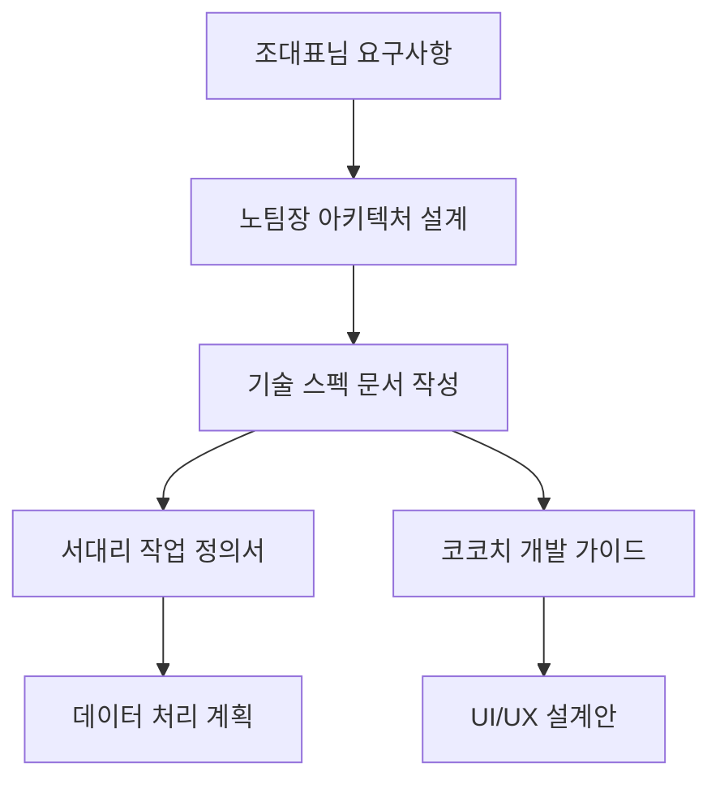
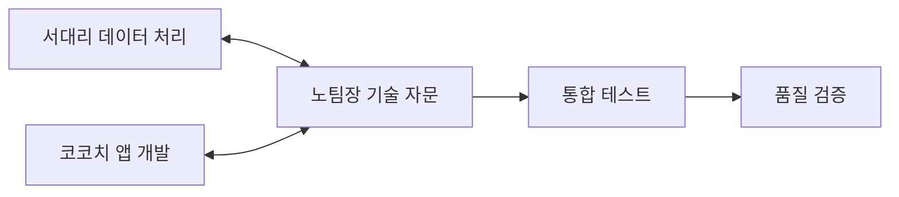
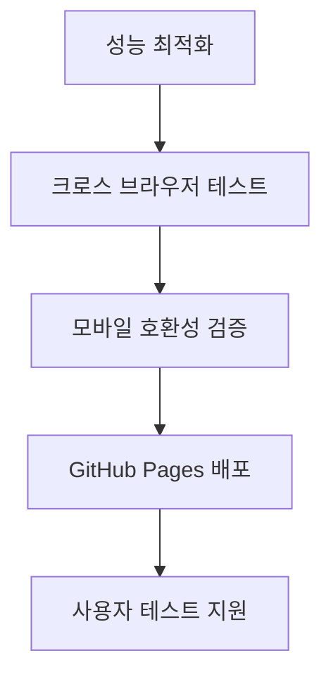

# AICU 앱 개발 3자 협업 체계 (노팀장 중심)

**작성일**: 2025년 7월 22일  
**목적**: 노팀장의 능력을 최대한 활용한 효율적 협업 체계 구축

---

## 1. 팀 구성 및 핵심 역할

### 🏢 **조대표님 (Project Owner)**
- **최종 의사결정**: 방향성, 우선순위, 승인
- **비즈니스 요구사항**: 학습 목표, 기능 요구사항 정의
- **사용자 테스트**: 실제 사용을 통한 피드백 제공
- **품질 검증**: 최종 결과물 검수 및 승인

### 🧠 **노팀장 (Technical Architect & Project Coordinator)**
- **시스템 아키텍처 설계**: 전체 기술 구조 및 최적화 방안
- **기술 자문 및 문제 해결**: 서대리, 코코치 기술 지원
- **품질 관리**: 코드 리뷰, 테스트, 표준화
- **프로젝트 조율**: 협업 프로세스 관리 및 최적화
- **연구 및 혁신**: 최신 기술 적용 및 학습 효과 극대화

### 🐍 **서대리 (Data Engineer)**
- **데이터 처리**: Python 기반 강력한 CSV/데이터 전처리
- **변환 시스템**: 선택형→진위형 변환 알고리즘 구현
- **성능 최적화**: 대용량 데이터 효율적 처리
- **자동화**: 데이터 파이프라인 구축

### 🌐 **코코치 (Frontend Developer & UX Engineer)**
- **웹앱 개발**: HTML/CSS/JavaScript 기반 사용자 인터페이스
- **학습 엔진**: 동적 난이도, 문제 제시 알고리즘 구현
- **모바일 최적화**: PWA, 반응형 디자인
- **사용자 경험**: UI/UX 설계 및 구현

---

## 2. 노팀장 중심 협업 워크플로우

### **Phase 1: 설계 및 계획 (노팀장 주도)**



#### **노팀장 주요 활동**
- 🎯 **요구사항 분석**: 조대표님 요구사항을 기술적 명세로 변환
- 📐 **시스템 설계**: 전체 아키텍처 및 데이터 플로우 설계
- 📋 **작업 계획**: 서대리, 코코치별 구체적 작업 계획 수립
- 📚 **표준 수립**: 코딩 표준, 네이밍 규칙, 파일 구조 정의

### **Phase 2: 개발 및 구현 (노팀장 조율)**



#### **노팀장 주요 활동**
- 🔧 **기술 지원**: 서대리, 코코치 기술적 이슈 해결
- 🔍 **코드 리뷰**: 정기적 코드 품질 검토 및 개선 제안
- 🧪 **통합 테스트**: 서대리-코코치 작업물 통합 검증
- 📊 **진행 관리**: 각자 진행상황 모니터링 및 조율

### **Phase 3: 최적화 및 배포 (노팀장 총괄)**



#### **노팀장 주요 활동**
- ⚡ **성능 최적화**: 로딩 속도, 메모리 사용량 최적화
- 🔬 **품질 보증**: 다양한 환경에서 테스트 및 검증
- 🚀 **배포 관리**: GitHub Pages 배포 프로세스 최적화
- 📈 **분석 및 개선**: 사용 데이터 분석 및 개선 방안 도출

---

## 3. 노팀장의 구체적 기술 기여

### **3.1 시스템 아키텍처 설계**

#### **데이터 아키텍처**
```javascript
// 노팀장이 설계하는 최적화된 데이터 구조
const QuestionDataStructure = {
    // 서대리가 처리할 원본 데이터
    rawData: "CSV files from 인스교재",
    
    // 변환된 데이터 (서대리 → 노팀장 검증)
    convertedData: {
        trueFalseQuestions: "544개 진위형 문제",
        metadata: "변환 추적 정보"
    },
    
    // 코코치가 사용할 최적화된 형태
    optimizedForWeb: {
        format: "JSON or optimized CSV",
        compression: "Gzip compression",
        caching: "Browser cache strategy"
    }
};
```

#### **앱 아키텍처**
```javascript
// 노팀장이 설계하는 모듈 구조
const AppArchitecture = {
    // 코코치 구현 영역
    presentation: {
        ui: "React-like component structure",
        routing: "SPA routing system",
        responsive: "Mobile-first design"
    },
    
    // 공통 비즈니스 로직 (노팀장-코코치 협업)
    business: {
        learningEngine: "동적 난이도 알고리즘",
        questionSelector: "우선순위 기반 문제 선택",
        progressTracker: "학습 진도 추적"
    },
    
    // 데이터 레이어 (서대리-노팀장 협업)
    data: {
        loader: "CSV/JSON 데이터 로더",
        parser: "문제 데이터 파싱",
        storage: "브라우저 저장소 관리"
    }
};
```

### **3.2 품질 관리 시스템**

#### **코드 리뷰 체크리스트 (노팀장 작성)**
```markdown
## 서대리 Python 코드 리뷰
- [ ] 데이터 무결성 검증
- [ ] 성능 최적화 (pandas 활용도)
- [ ] 에러 처리 및 로깅
- [ ] CSV 출력 품질 검증

## 코코치 JavaScript 코드 리뷰  
- [ ] 모바일 호환성
- [ ] 브라우저 호환성
- [ ] 성능 최적화 (메모리, 렌더링)
- [ ] 사용자 경험 품질
```

#### **통합 테스트 시나리오 (노팀장 설계)**
```javascript
const IntegrationTests = {
    dataFlow: {
        test: "서대리 CSV → 코코치 앱 데이터 로딩",
        expected: "모든 문제가 정확히 로드되는가?"
    },
    
    performance: {
        test: "1,200개 문제 로딩 성능",
        expected: "3초 이내 초기 로딩 완료"
    },
    
    mobile: {
        test: "iOS/Android 브라우저 호환성",
        expected: "터치 인터페이스 정상 동작"
    },
    
    offline: {
        test: "오프라인 사용 가능성",
        expected: "한 번 로드 후 인터넷 없이 사용 가능"
    }
};
```

### **3.3 혁신적 기능 연구 및 제안**

#### **AI 기반 학습 최적화 (노팀장 연구 영역)**
```javascript
// 노팀장이 연구하고 제안하는 고급 기능들
const AdvancedFeatures = {
    adaptiveLearning: {
        description: "개인별 학습 패턴 분석",
        implementation: "머신러닝 기반 문제 추천",
        responsibility: "노팀장 연구 → 코코치 구현"
    },
    
    knowledgeMapping: {
        description: "지식 영역별 이해도 맵핑",
        implementation: "LAYER1/2/3 기반 약점 분석",
        responsibility: "노팀장 설계 → 서대리 데이터 → 코코치 시각화"
    },
    
    predictiveAnalytics: {
        description: "시험 성적 예측 시스템",
        implementation: "학습 이력 기반 예측 모델",
        responsibility: "노팀장 알고리즘 → 서대리 구현 → 코코치 UI"
    }
};
```

---

## 4. 커뮤니케이션 및 조율 시스템

### **4.1 정기 미팅 체계 (노팀장 주관)**

#### **주간 기술 미팅 (매주 금요일)**
- **참석자**: 조대표님, 노팀장, 서대리, 코코치
- **안건**: 주간 진행사항, 기술적 이슈, 다음 주 계획
- **노팀장 역할**: 미팅 진행, 기술 이슈 해결방안 제시

#### **일일 스탠드업 (월-목)**
- **형태**: 간단한 텍스트 공유 (Discord/Slack)
- **내용**: 어제 완료, 오늘 계획, 장애 요소
- **노팀장 역할**: 이슈 조기 발견 및 해결 지원

### **4.2 이슈 관리 시스템**

#### **GitHub Issues 활용 (노팀장 관리)**
```markdown
## 이슈 템플릿

### 🐛 버그 리포트
- 발견자: [서대리/코코치]
- 우선순위: [High/Medium/Low]
- 담당자: [노팀장이 할당]

### 💡 기능 개선
- 제안자: [누구나]
- 기술 검토: [노팀장]
- 구현 담당: [서대리/코코치]

### 🔧 기술 지원 요청
- 요청자: [서대리/코코치]
- 지원 담당: [노팀장]
- 긴급도: [즉시/당일/주간]
```

---

## 5. 성과 측정 및 개선

### **5.1 KPI 설정 (노팀장 제안)**

#### **개발 효율성 지표**
- **코드 품질**: 버그 발생률, 코드 리뷰 통과율
- **개발 속도**: 기능별 구현 소요 시간
- **협업 효과**: 이슈 해결 속도, 커뮤니케이션 효율성

#### **서비스 품질 지표**
- **성능**: 로딩 속도, 반응 속도, 메모리 사용량
- **사용성**: 모바일 호환성, 브라우저 호환성
- **안정성**: 오류 발생률, 데이터 무결성

### **5.2 지속적 개선 프로세스**

#### **주간 회고 (노팀장 진행)**
- **What went well**: 잘된 점 공유
- **What could be improved**: 개선이 필요한 점
- **Action items**: 구체적 개선 액션

#### **월간 기술 리뷰 (노팀장 주도)**
- **기술 트렌드 분석**: 새로운 기술 적용 가능성
- **성능 최적화**: 병목 지점 분석 및 개선
- **사용자 피드백**: 조대표님 피드백 기반 개선

---

## 6. 노팀장의 독특한 가치 제공

### **6.1 크로스 도메인 전문성**
- **기술 + 비즈니스**: 기술적 구현과 비즈니스 가치 연결
- **이론 + 실무**: 학습 이론을 실제 구현으로 연결
- **분석 + 종합**: 복잡한 문제를 체계적으로 분석하고 해결

### **6.2 혁신적 사고**
- **패러다임 전환**: 선택형→진위형 변환 아이디어 검증 및 발전
- **최적화 관점**: 성능, 사용성, 학습 효과의 균형점 찾기
- **미래 지향**: 확장 가능하고 지속 가능한 솔루션 설계

### **6.3 품질 보증**
- **객관적 검증**: 감정적 판단이 아닌 데이터 기반 품질 평가
- **사용자 관점**: 조대표님의 학습 목표를 기술적으로 실현
- **전체적 시각**: 부분 최적화가 아닌 전체 시스템 최적화

---

## 7. 성공적 협업을 위한 핵심 원칙

### **7.1 역할 명확화**
- 각자의 전문 영역에서 최고의 성과 발휘
- 겹치는 영역에서는 노팀장이 조율 역할

### **7.2 투명한 소통**
- 모든 결정과 변경사항 공유
- 문제 발생 시 즉시 공유 및 해결

### **7.3 지속적 학습**
- 서로의 전문성에서 배우기
- 새로운 기술과 방법론 적극 도입

### **7.4 사용자 중심**
- 모든 결정의 중심에 조대표님의 학습 목표
- 기술적 우아함보다 실용적 가치 우선

---

**이 협업 체계로 노팀장의 능력을 최대한 활용하여 최고 품질의 ACIU 학습 앱을 만들어나가겠습니다!** 🚀